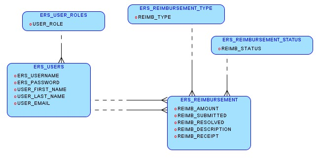

# Employee Reimbursement System (ERS)

## Executive Summary
The Expense Reimbursement System (ERS) will manage the process of reimbursing employees for expenses incurred while on company time. All employees in the company can login and submit requests for reimbursement and view their past tickets and pending requests. Finance managers can log in and view all reimbursement requests and past history for all employees in the company. Finance managers are authorized to approve and deny requests for expense reimbursement.

**State-chart Diagram (Reimbursement Statuses)** 

**Reimbursement Types**

Employees must select the type of reimbursement as: LODGING, TRAVEL, FOOD, or OTHER.

**Logical Model**

**Physical Model**

**Use Case Diagram**

**Activity Diagram**

## Technologies used

* JDBC to connect to an AWS Postgres database
* Javalin for dynamic web application development
* HTML to create and structure the webpage
* Javalin to implement logic for the webpage and connect to server-side components
* Java for creating the server-side application and all its business logic
* JUnit and Mockito for creating tests to be used for Test Driven Development
* Logback for providing persistent logging where appropriate

## Features

* All employees in the company can login and submit requests for reimbursement
* Employees that are "Associates" are only able to view their own reimbursement requests
* Employees that are "Managers" are able to view reimbursement requests for all employees
* All employees are able to filter the requests in their view by status (Pending, Approved, Denied)
* Managers are able to approve or deny reimbursement requests

## Getting Started

## Usage

## Contributers

Zachary Byrski 
Ivo Vladkov

## Technical Requirements

The back-end system shall use JDBC to connect to an AWS RDS Postgres database and Javalin technology for dynamic Web application development. The front-end view shall use HTML/JavaScript to make an application that can call server-side components RESTfully. Passwords shall be encrypted in Java and securely stored in the database. The middle tier shall follow proper layered architecture, have reasonable test coverage of the service and DAO layers with JUnit and Mockito, and implement Logback for appropriate logging. Proper and reasonable validation in both the front-end and back-end are expected. 

## Development Requirements

The project will be completed with a pair of developers. Developers will be required to engage in at least 2 pair programming sessions during the project of 2-3 hours each. Developers should switch between pilot and navigator about every half hour. Specific times will be provided for these sessions. 

Test Driven Development is also required for all Service and Repository layer classes in the Java backend. To facilitate this one developer should write the unimplemented methods for a class and the other should write tests for the code before implementation. This process should be viewable through git commits. 

The project will be due no earlier than the Friday of Week 5. 

**Stretch Goals:**
* Replace HTML/JavaScript with an Angular single page application.
* Users can upload a document or image of their receipt when submitting reimbursements which can stored in the database and reviewed by a financial manager.
* Application shall be hosted remotely on an EC2.
* Static files (webpages) shall be hosted on an S3 bucket. 
